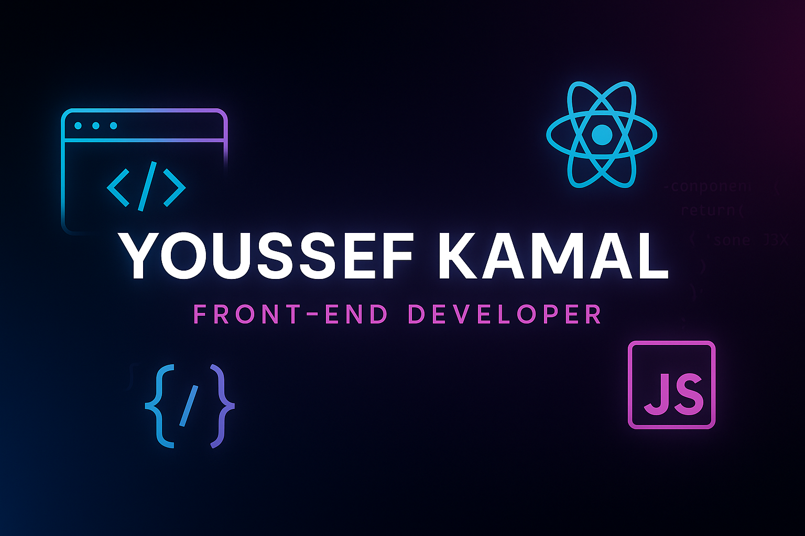

<!-- 🔥 BANNER -->

<!-- PROFILE HEADER -->
<h1 align="center">👋 Hi, I'm Youssef Kamal</h1>
<h3 align="center">🎓 Front-End Developer | React Enthusiast | Tech Explorer</h3>

  

---

## 🧠 About Me

- 🧑‍🎓 Recent graduate from **Faculty of Computers and Artificial Intelligence – Benha University**
- 💻 Specialized in **React.js**, **Redux Toolkit**, **Tailwind CSS**, **Formik**, **Yup**, and **React Query**
- ⚙️ Built a full-stack **medical + e-commerce platform** with AI-powered diagnosis & AR-based virtual try-on
- 📱 Collaborated with AI, Flutter, and .NET teams in my graduation project
- 🌱 Currently learning **Next.js** and **advanced React patterns**

---

## 🔧 Tech Stack & Tools

  

---

## 🔥 My Featured Projects

### 👁️ Eye Care Hub (Graduation Project)
🩺 Medical & E-commerce platform with AI diagnosis and glasses try-on  
💡 Technologies: React.js, Redux Toolkit, Tailwind CSS, React Icons, React Query, React Router Dom, Formik, Yup  
🔗 [View Repo](https://github.com/Yousof27/Graduation-Project)

### 🛒 bestYshop Market
🛍️ E-commerce frontend with filterable product cards and cart  
💡 Technologies: HTML, CSS, JavaScript  
🔗 [View Repo](https://github.com/Yousof27/Project9)

### 🌐 Portfolio Website (Coming Soon)
💼 Personal portfolio with project gallery and contact form  
💡 Technologies: React.js, Tailwind CSS, EmailJS  
🔗 [View Repo](#)

---

## 📈 GitHub Stats

  

  

  

---

## 📫 Let’s Connect!

  
  
  

---

<!-- FOOTER -->

  

